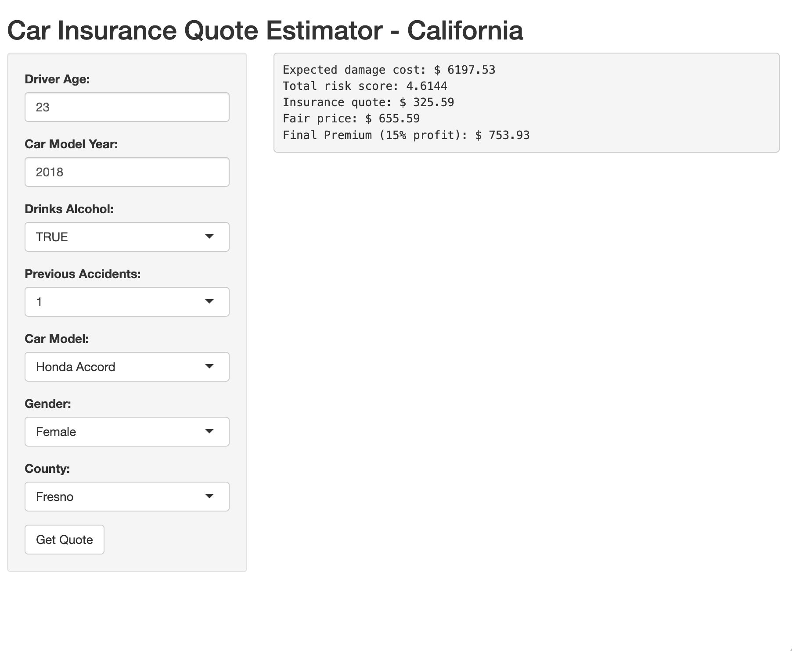

# 🚗 Car Insurance Premium Estimator (R & Shiny)

This project develops an end-to-end insurance pricing model using simulated California vehicle and crash data.

## 📊 Project Overview

The goal of this project is to replicate how insurance companies estimate risk and calculate premiums using data-driven approaches.

The model integrates:
- Synthetic data generation (5M vehicles, 300K crashes)
- Risk segmentation using relative risk indices
- Expected damage estimation via linear regression
- Insurance pricing logic (risk-based premium calculation)
- Interactive Shiny application for real-time quotes

---

## ⚙️ Methodology

### 1. Data Generation
- Simulated vehicle population based on real-world distributions
- Simulated crash dataset with property damage costs

### 2. Risk Index Construction
Risk factors are calculated using:

Risk Index = (Crash Share) / (Population Share)

Applied to:
- Car model
- Model year
- Driver age group
- Alcohol usage
- Accident history

### 3. Expected Damage Model
- Linear regression model (lm)
- Predicts property damage cost
- Uses driver, vehicle, and regional variables

### 4. Pricing Model
Final premium is calculated as:

Premium = Expected Damage × Risk Score × Baseline Risk + Costs + Profit

---

## 🖥️ Shiny Application

The project includes an interactive app where users can input:

- Driver age  
- Car model & year  
- Accident history  
- Alcohol usage  
- Location  

➡️ Output:
- Expected damage
- Risk score
- Insurance premium

---

## 📸 Application Screenshot

---

## 📁 Project Structure

- `insurance_model.R` → Full data generation & pricing logic  
- `app.R` → Shiny application  
- `insurance_project_detailed_report.pdf` → Full report  

---

## ⚠️ Limitations

- Data is simulated (not real insurer data)
- Some risk factors are simplified
- Only property damage is modeled (no claim frequency)

---

## 🚀 Future Improvements

- Use real insurance datasets
- Apply GLM / actuarial pricing models
- Add claim frequency modeling
- Improve risk segmentation

---

## 🧠 Key Takeaway

This project demonstrates a complete insurance pricing pipeline from data generation to premium calculation and decision support.
